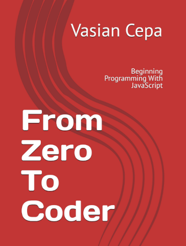

# From Zero To Coder: Beginning Programming With JavaScript

[Get from Amazon](https://www.amazon.com/dp/B0D2W3QML8)    

    
**From Zero To Coder** provides a comprehensive guide to learning software programming using modern JavaScript. Get a broad perspective from the basics to advanced topics to experiment and learn.

* **Chapter One**: Explains how the web and computers work and introduces HTML, CSS and JavaScript.  Each section includes links for further exploration.

* **Chapter Two**: Teaches programming through JavaScript, exploring basic algorithms and language features such as built-in types, generators, modules and classes.

* **Chapter Three**: Addresses core web technologies and JavaScript interaction with the browser. Basic 2D graphics with canvas, DOM manipulation, web workers, client-side routing and asynchronous programming.

* **Chapter Four**: Expands JavaScript knowledge to server-side programming using Node.js. A complete web server example with a single-page client application in vanilla JavaScript.

* **Chapter Five**: Demonstrates learning from data by implementing a neural network from scratch and a board of cell robots that learn independently to move. Scalable Vector Graphics (SVG) and its manipulation via JavaScript are used to draw the neural network.

* **Appendix**: Provides an introduction to source control with Git, making the book self-contained for beginners without needing other resources.

This book targets both beginners and those looking to deepen their JavaScript and web development skills. The shown code maximizes the learning effect by not using any third-party JavaScript libraries. All code examples are *freely* available for download.

## Book Online Materials

* **View** [Table of Contents](./book/zero2coder-toc.pdf)

* **Download** [Source Code](https://github.com/mbpub/jsbook/archive/refs/heads/main.zip) | [Code License](./license.txt)

## Get The Book

1. **Paperback**: [Amazon Book Store](https://www.amazon.com/dp/B0D2W3QML8) | **ISBN**: 9798323951956 | black & white
2. **Hardcover**: [Amazon Book Store](https://www.amazon.com/dp/B0D32YVXFL) | **ISBN**: 9798324479015 | color

## Details

* **Beginner-Friendly Approach**: Designed for absolute beginners, this book assumes no prior coding experience, making it perfect for those taking their first steps into the world of programming.

* **Learn JavaScript**: Master the fundamentals of modern JavaScript, the language powering the web, through clear explanations, hands-on exercises, and real-world examples.

* **Understanding Algorithms**: Gain a solid understanding of fundamental algorithms and data structures, essential building blocks for solving complex problems in programming.

* **Interactive Learning**: Dive into practical coding exercises and projects that reinforce your understanding of key concepts, ensuring active engagement and accelerated learning.

* **Browser and Node.js**: Explore both client-side and server-side JavaScript development by learning how to create interactive web applications for the browser and build powerful backend services with Node.js.

* **Real-World Applications**: Apply your newfound skills to build practical projects, from simple web pages to dynamic web applications, preparing you for real-world programming challenges.

* **Accessible Resources**: Access additional resources and support materials online, including code samples, exercises, and supplementary materials to enhance your learning journey.

* **Comprehensive Guidance**: Benefit from comprehensive guidance every step of the way, with clear explanations, code walkthroughs, and troubleshooting tips to help you overcome any obstacles.

* **Empowerment**: Empower yourself with the skills and knowledge needed to pursue a career in software development or embark on personal projects with confidence and enthusiasm.

*Your Journey Starts Here*: Whether you aspire to become a professional software developer or simply want to explore the world of programming, *From Zero To Coder* is your definitive guide to mastering JavaScript and unlocking the doors to endless possibilities in the digital realm. [Get from Amazon](https://www.amazon.com/dp/B0D2W3QML8)

---
**&copy; 2024** Vasian Cepa. This repository is frozen. Pull requests are ignored.
